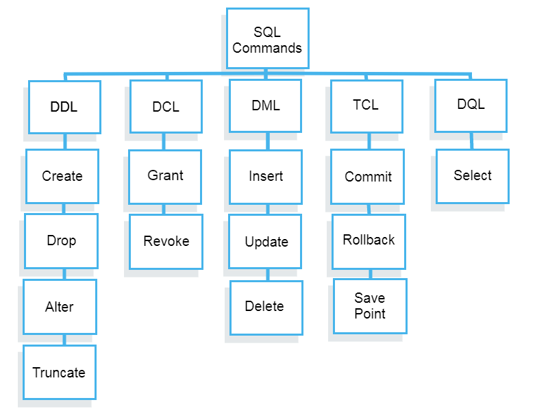

sql 
sql is used to store data in the form of rows and coloums 

databases > tables 

`show databases;`

`create database practice;`

`use practice;`

`show tables;`

create table tablename(
    id int,
    name varchar(100),
    email varchar(100)
)

`create table students(id int, name varchar(100), email varchar(100));`

`select * from students;`

`insert into students values(1,"Anvesh","anvesh@gmail.com");`

pip install mysql-connector-python

if we are changnging any data from the table then we need to commit the table 
if any error comes we need to rollback 

update record from table 
update students set name="hello2",email="hello2@gmail.com" where id=10;

delete record from table
delete from students where id=10;

delete 
deletes records followed condtion 
`delete from students where id=10`
if we dont give condition 
`delete from students`
delete all values

diffrence between `delete from students` and `truncate table students`
delete 
temporarly deletes the records 
if we rollback before commit then records will be retrives
we cant get deleted records after commit

truncate 
permenentaly deletes the records
we cant rollback

Data definination language
define
create (database,table)
alter (change table coloums)
truncate
drop

data manipulation lanaguage
insert 
delete 
update

### Here are five types of widely used SQL queries.

- Data Definition Language (DDL)
- Data Manipulation Language (DML)
- Data Control Language(DCL)
- Transaction Control Language(TCL)
- Data Query Language (DQL)

SQL:
- DDL -> data defination language
    - create
    - drop 
    - truncate
    - rename
    - alter
- DML -> data manupilation language
    - insert
    - update
    - delete
- TCL -> transactional control statements
    - rollback
    - commit
    - savepoint

- DCL -> data control language
    - grant 
    - revoke

## table constrains
- constrains -> RDBMS
    - primary key
    - foriegn key
    - null key
    - unique key
## joins
- Full join
- cross join 
- left join 
- right join

## sub queries
- 

## Normalization methodology
- 

## working on clauses
- where clause
- order by clause
- having clause + Aggregate functions

### Aggregate functions
- sum()
- count()
- max()
- min()
- avg()

# PL/SQL
- unserstanding PL/SQL blocks
- Triggers in PL/SQL
- Stor procedures
- Functions
- Packages