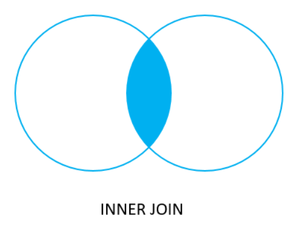
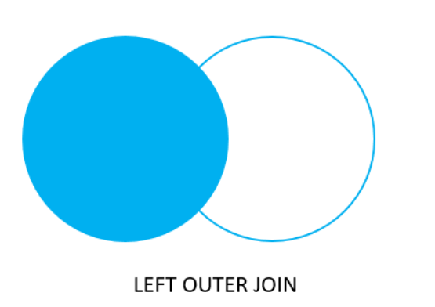
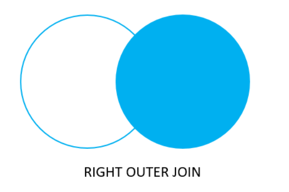

# Joins

- joins in mysql are used to retrive the data from multiple tables based on a related coloumn between them
- a join clause is used to combine rows two or more tables, based on a related coloumn between them

1. inner join
    - inner join keyword selects records that have matching values in both tables
    - return rows where there is a match in both rows
    - 
    - `SELECT * FROM table1 INNER JOIN table2 ON table1.Colname = table2.Colname;`
2. LEFT join
    - return all records from left table and return matching records from the right table
    - the unmathed record from right table will return null
    - 
    - `SELECT * FROM table1 LEFT JOIN table2 ON table1.Colname = table2.Colname;`
3. RIGHT join
    - return all records from right table and return matching records from the left table
    - the unmathed record from left table will return null
    - 
    - `SELECT * FROM table1 RIGHT JOIN table2 ON table1.Colname = table2.Colname;`
4. FULL join
    - 